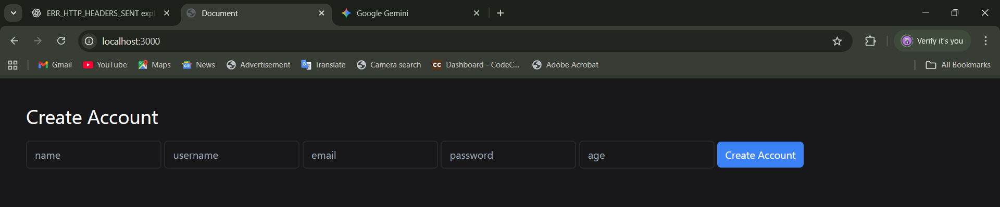
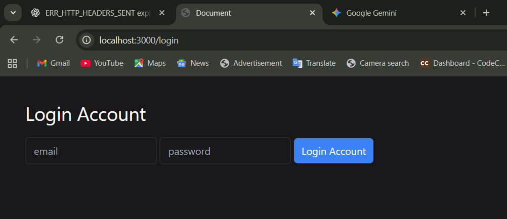
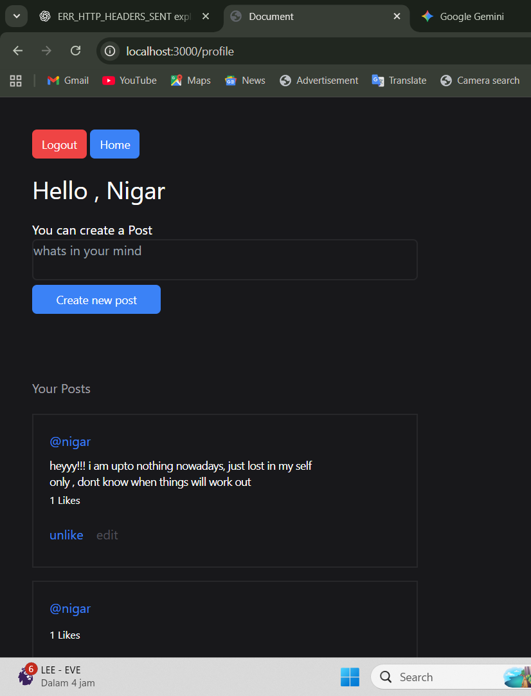
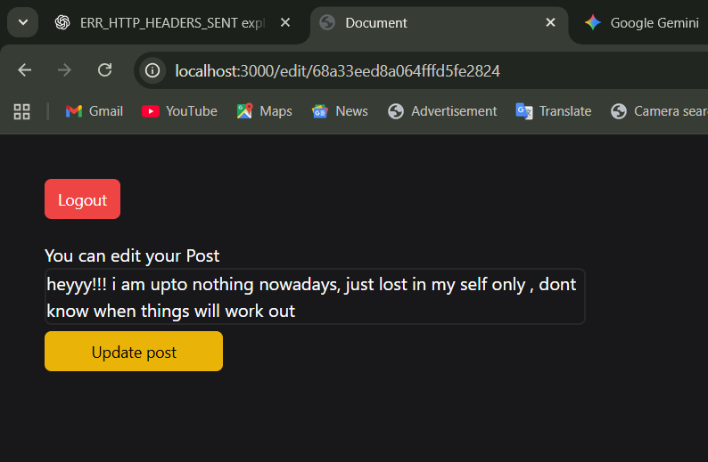

# Mini Social Media App

A simple social media style web application built with **Node.js, Express, MongoDB, EJS, JWT, and bcrypt**.  
This project includes **user authentication, post creation, like/unlike, and post editing** features.  

---

## 🚀 Features
- User Registration & Login (with JWT authentication & cookies)
- Passwords stored securely with bcrypt hashing
- Create, edit, and delete posts
- Like/Unlike functionality for posts
- User Profile page showing all posts
- Session handling with JWT and cookies
- Logout functionality

---

## 🛠️ Tech Stack
- **Backend:** Node.js, Express.js  
- **Database:** MongoDB, Mongoose  
- **Authentication:** JWT, bcrypt, cookie-parser  
- **Frontend:** EJS templates, CSS  

---

## 📸 Screenshots

### Create Account

### Login Page

### User Profile

### Edit Post

------To run the project------
npx nodemon app.js 

