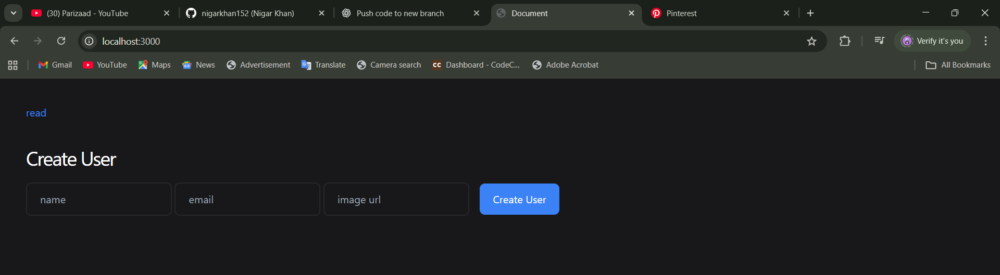
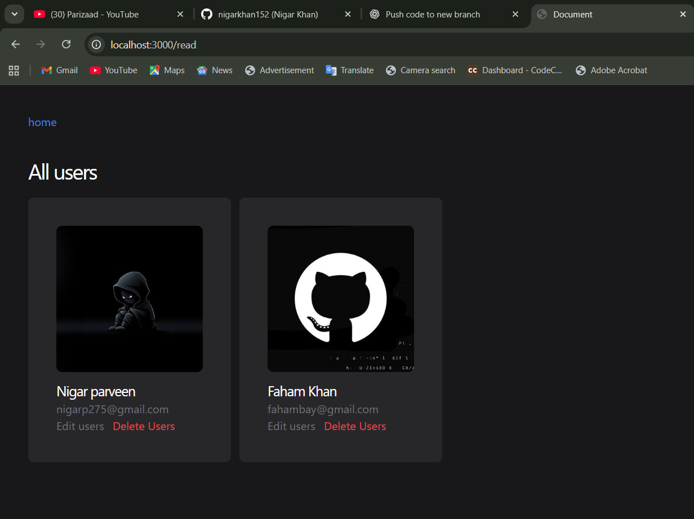

📝 User Management System (CRUD App)

A simple User Management System built with Node.js, Express, MongoDB, and EJS.
This app allows you to create, read, update, and delete (CRUD) user profiles with images, names, and email addresses.

🚀 Features
➕ Create new users with name, email, and image.
📋 View all users.
✏️ Edit user details.
❌ Delete users.
🎨 EJS templates for frontend rendering.
📂 Static file support for images and CSS.

🛠️ Tech Stack
Backend: Node.js, Express.js
Database: MongoDB (Mongoose ODM)
Frontend: EJS (Embedded JavaScript Templates)
Styling: CSS (custom styles in public/stylesheet/style.css)

📌 API Routes
Method	           Route	            Description
GET	                /	                  Homepage
GET	                /read	           View all users
GET	               /edit/:id	       Edit user form
POST	           /update/:id	       Update user details
GET	               /delete/:id	        Delete user
POST	            /create	             Add new user

### 🏠 Home Page

### 🔑 Profie Page
