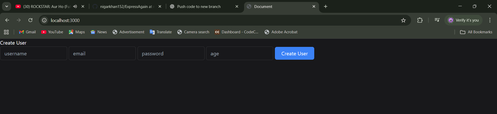

# Authentication Web App 🔐

A simple **Node.js + Express.js** authentication system with **EJS views**, **bcrypt password hashing**, and **JWT authentication**.  
This app demonstrates **user registration, login, and protected routes**.

## 🚀 Features
- User Registration (with bcrypt password hashing)
- User Login with JWT authentication
- Cookie-based token storage
- EJS templating engine for frontend views
- Simple UI for authentication

## 🛠️ Tech Stack
- **Backend**: Node.js, Express.js
- **Authentication**: bcrypt, JWT
- **Database**: MongoDB (via Mongoose)
- **Frontend**: EJS, HTML, CSS
- **Other**: cookie-parser

### 🏠 Home Page


### 🔑 Login Page


---

## ⚙️ Installation & Setup

1. Clone the repository:
   ```bash
   git clone https://github.com/your-username/AuthenticationWeb.git
   cd AuthenticationWeb

run the app: npx nodemon app.js
